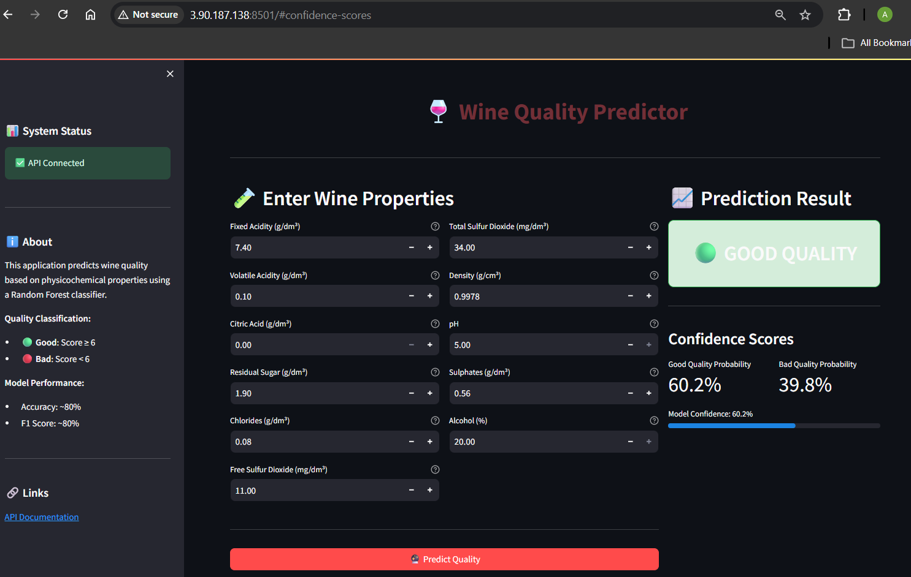

# Wine Quality Classification - Full MLOps Pipeline

A complete end-to-end MLOps project that predicts wine quality (good/bad) based on physicochemical properties using machine learning, deployed on AWS with CI/CD automation.



## Live Demo

| Service | URL |
|---------|-----|
| **Streamlit UI** | http://3.90.187.138:8501 |
| **FastAPI** | http://3.90.187.138:8000 |
| **API Documentation** | http://3.90.187.138:8000/docs |

## Project Overview

This project demonstrates a **production-ready MLOps pipeline** including:

- **ML Pipeline**: Data preprocessing, model training, experiment tracking with MLflow
- **API**: FastAPI REST API with automatic documentation
- **Frontend**: Interactive Streamlit UI for predictions
- **Containerization**: Docker with multi-stage builds
- **CI/CD**: GitHub Actions for automated testing and deployment
- **Cloud Deployment**: AWS ECR + EC2 with automated deployments

## Architecture

```
┌─────────────────┐     ┌─────────────────┐     ┌─────────────────┐
│   Developer     │────▶│    GitHub       │────▶│  GitHub Actions │
│   Push Code     │     │   Repository    │     │    CI/CD        │
└─────────────────┘     └─────────────────┘     └────────┬────────┘
                                                         │
                        ┌────────────────────────────────┼────────────────────────────────┐
                        │                                ▼                                │
                        │  ┌─────────────────┐     ┌─────────────────┐                   │
                        │  │   Run Tests     │────▶│  Build Docker   │                   │
                        │  │   (pytest)      │     │     Image       │                   │
                        │  └─────────────────┘     └────────┬────────┘                   │
                        │                                   │                             │
                        │                                   ▼                             │
                        │                          ┌─────────────────┐                   │
                        │                          │   Push to ECR   │                   │
                        │                          └────────┬────────┘                   │
                        │                                   │                             │
                        │                                   ▼                             │
                        │                          ┌─────────────────┐                   │
                        │                          │  Deploy to EC2  │                   │
                        │                          └────────┬────────┘                   │
                        │                                   │                             │
                        └───────────────────────────────────┼─────────────────────────────┘
                                                            │
                                                            ▼
                        ┌─────────────────────────────────────────────────────────────────┐
                        │                         AWS EC2                                  │
                        │  ┌─────────────────┐     ┌─────────────────┐                   │
                        │  │   FastAPI       │◀───▶│   Streamlit     │                   │
                        │  │   :8000         │     │   :8501         │                   │
                        │  └─────────────────┘     └─────────────────┘                   │
                        └─────────────────────────────────────────────────────────────────┘
```

## Dataset

The [Wine Quality Dataset](https://archive.ics.uci.edu/ml/datasets/wine+quality) from UCI Machine Learning Repository contains physicochemical properties of red wine samples.

**Features (11 input variables):**
- Fixed acidity, Volatile acidity, Citric acid
- Residual sugar, Chlorides
- Free/Total sulfur dioxide
- Density, pH, Sulphates, Alcohol

**Target:** Binary classification
- **Good Quality**: Score ≥ 6
- **Bad Quality**: Score < 6

## Project Structure

```
wine_quality/
├── data/
│   └── wine_quality.csv          # Dataset (downloaded)
├── src/
│   ├── __init__.py
│   ├── preprocess.py             # Data preprocessing & scaling
│   ├── train.py                  # Model training with MLflow
│   └── predict.py                # Prediction utilities
├── api/
│   ├── __init__.py
│   └── main.py                   # FastAPI application
├── streamlit_app/
│   └── app.py                    # Streamlit UI
├── models/
│   ├── model.pkl                 # Trained Random Forest model
│   └── scaler.pkl                # Feature scaler
├── tests/
│   ├── test_train.py             # Training tests
│   └── test_api.py               # API tests
├── .github/
│   └── workflows/
│       └── cicd.yml              # GitHub Actions CI/CD
├── assets/
│   └── streamlit-ui.png          # Screenshot
├── mlruns/                       # MLflow experiment tracking
├── Dockerfile                    # Multi-stage Docker build
├── docker-compose.yml            # Local development setup
├── config.yaml                   # Configuration
├── requirements.txt              # Python dependencies
└── README.md
```

---

## Complete Setup Guide

### Phase 1: Local Development

#### 1.1 Clone and Setup Environment

```bash
git clone https://github.com/alirezasaberi20/wine-quality-mlops.git
cd wine-quality-mlops

# Create virtual environment
python -m venv venv
source venv/bin/activate  # Linux/Mac
# or: venv\Scripts\activate  # Windows

# Install dependencies
pip install -r requirements.txt
```

#### 1.2 Download Dataset

```bash
mkdir -p data
curl -o data/wine_quality.csv "https://archive.ics.uci.edu/ml/machine-learning-databases/wine-quality/winequality-red.csv"
```

#### 1.3 Train the Model

```bash
python -m src.train
```

This will:
- Load and preprocess the wine quality dataset
- Train a Random Forest classifier
- Log metrics to MLflow (accuracy, precision, recall, F1)
- Save model artifacts to `models/`

#### 1.4 View MLflow Experiments

```bash
mlflow ui --host 0.0.0.0 --port 5000
```
Open http://localhost:5000 to compare experiments.

#### 1.5 Run the API Locally

```bash
# Option 1: FastAPI dev mode
fastapi dev api/main.py --host 0.0.0.0 --port 8000

# Option 2: Uvicorn
uvicorn api.main:app --reload --host 0.0.0.0 --port 8000
```

#### 1.6 Run Streamlit UI Locally

```bash
streamlit run streamlit_app/app.py --server.port 8501
```

#### 1.7 Run Tests

```bash
pytest tests/ -v
```

---

### Phase 2: Docker Containerization

#### 2.1 Build Docker Image

```bash
docker build -t wine-quality-api:latest .
```

#### 2.2 Run with Docker

```bash
docker run -d -p 8000:8000 --name wine-api wine-quality-api:latest
```

#### 2.3 Run with Docker Compose (API + Streamlit + MLflow)

```bash
# Start all services
docker-compose up -d

# With MLflow UI (dev profile)
docker-compose --profile dev up -d

# View logs
docker-compose logs -f

# Stop services
docker-compose down
```

---

### Phase 3: AWS Deployment

#### 3.1 Create AWS Resources

**ECR Repository:**
1. Go to AWS Console → ECR
2. Create repository: `wine-quality-api`

**EC2 Instance:**
1. Go to AWS Console → EC2 → Launch Instance
2. AMI: Amazon Linux 2023
3. Instance type: t3.micro (or t2.micro for free tier)
4. Key pair: Create and download `.pem` file
5. Security Group - Allow inbound:
   - SSH (22) from your IP
   - HTTP (80) from anywhere
   - Custom TCP (8000) from anywhere - FastAPI
   - Custom TCP (8501) from anywhere - Streamlit

**IAM User for GitHub Actions:**
1. Go to IAM → Users → Create user
2. Name: `github-actions-wine-quality`
3. Attach policies:
   - `AmazonEC2ContainerRegistryFullAccess`
   - `AmazonEC2ReadOnlyAccess`
4. Create access key → Save credentials

#### 3.2 Configure EC2 Instance

SSH into EC2 and run:

```bash
# Install Docker
sudo yum update -y
sudo yum install -y docker
sudo systemctl start docker
sudo systemctl enable docker
sudo usermod -aG docker $USER

# Configure AWS CLI
aws configure
# Enter: Access Key ID, Secret Key, Region (us-east-1), Output (json)
```

#### 3.3 Add GitHub Secrets

Go to: Repository → Settings → Secrets and variables → Actions

Add these secrets:

| Secret Name | Value |
|-------------|-------|
| `AWS_ACCESS_KEY_ID` | IAM user access key |
| `AWS_SECRET_ACCESS_KEY` | IAM user secret key |
| `EC2_HOST` | EC2 public IP address |
| `EC2_USERNAME` | `ec2-user` |
| `EC2_SSH_KEY` | Contents of `.pem` file |

#### 3.4 Push Code to Trigger Deployment

```bash
git add .
git commit -m "Deploy to AWS"
git push origin main
```

The GitHub Actions workflow will:
1. ✅ Run tests (pytest)
2. ✅ Build Docker image
3. ✅ Push to AWS ECR
4. ✅ Deploy to EC2 via SSH

Monitor at: https://github.com/YOUR_USERNAME/wine-quality-mlops/actions

---

## API Endpoints

| Endpoint | Method | Description |
|----------|--------|-------------|
| `/` | GET | API info |
| `/health` | GET | Health check |
| `/predict` | POST | Single prediction |
| `/predict_batch` | POST | Batch predictions |
| `/features` | GET | Feature descriptions |
| `/sample` | GET | Sample input data |

### Example Request

```bash
curl -X POST "http://3.90.187.138:8000/predict" \
  -H "Content-Type: application/json" \
  -d '{
    "fixed_acidity": 7.4,
    "volatile_acidity": 0.7,
    "citric_acid": 0.0,
    "residual_sugar": 1.9,
    "chlorides": 0.076,
    "free_sulfur_dioxide": 11.0,
    "total_sulfur_dioxide": 34.0,
    "density": 0.9978,
    "pH": 3.51,
    "sulphates": 0.56,
    "alcohol": 9.4
  }'
```

### Example Response

```json
{
  "prediction": 0,
  "quality_label": "bad",
  "probability_bad": 0.87,
  "probability_good": 0.13,
  "confidence": 0.87
}
```

---

## Model Performance

| Metric | Score |
|--------|-------|
| Accuracy | ~80% |
| Precision | ~82% |
| Recall | ~80% |
| F1 Score | ~81% |

**Top Features by Importance:**
1. Alcohol
2. Sulphates
3. Volatile Acidity
4. Total Sulfur Dioxide
5. Density

---

## CI/CD Pipeline

The GitHub Actions workflow (`.github/workflows/cicd.yml`) runs on every push to `main`:

```yaml
Jobs:
  1. test        → Run pytest
  2. build       → Build Docker image
  3. push-ecr    → Push to AWS ECR
  4. deploy      → SSH to EC2, pull image, restart containers
```

---

## Configuration

Edit `config.yaml` to customize:

```yaml
model:
  type: "random_forest"  # or "logistic_regression"
  random_forest:
    n_estimators: 100
    max_depth: 10

data:
  quality_threshold: 6  # wines >= 6 are "good"
  test_size: 0.2
```

---

## Tech Stack

| Category | Technologies |
|----------|-------------|
| **ML** | scikit-learn, pandas, numpy |
| **Tracking** | MLflow |
| **API** | FastAPI, Uvicorn, Pydantic |
| **Frontend** | Streamlit |
| **Container** | Docker, Docker Compose |
| **CI/CD** | GitHub Actions |
| **Cloud** | AWS (ECR, EC2) |
| **Testing** | pytest |

---

## Project Phases Completed

- [x] **Phase 1**: Local Model Development with MLflow
- [x] **Phase 2**: FastAPI REST API
- [x] **Phase 3**: Docker Containerization
- [x] **Phase 4**: CI/CD with GitHub Actions
- [x] **Phase 5**: AWS Deployment (ECR + EC2)
- [x] **Phase 6**: Full Integration & Live Demo

---

## Author

**Alireza Saberi**  
Data Science Master's Graduate - University of Padua

---

## License

MIT License - feel free to use this project as a template for your own MLOps projects!
